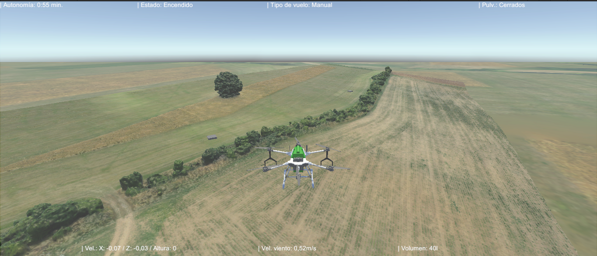
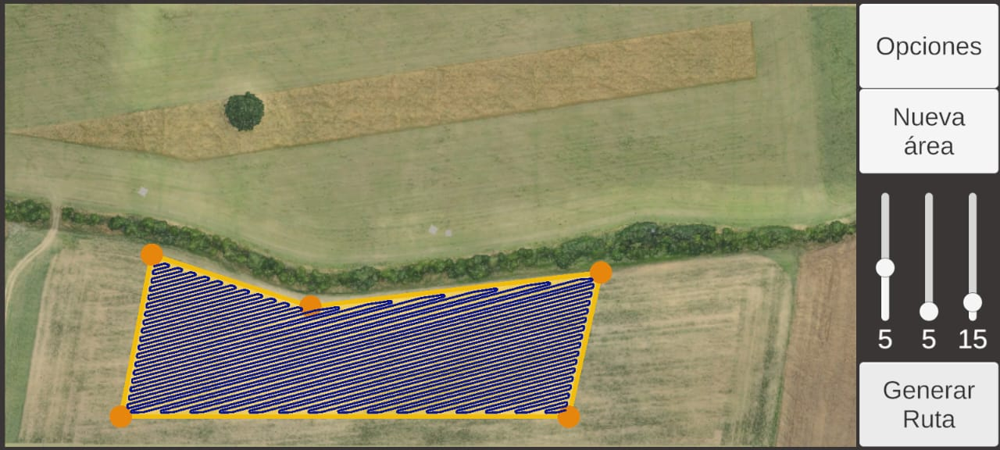

# Simulador de Dron de Fumigación

Proyecto Final Integrador de la asignatura **Realidad Virtual**, desarrollado en la carrera de **Ingeniería Mecatrónica — Universidad Nacional de Cuyo (UNCuyo)**.

El proyecto consiste en un entorno virtual desarrollado en **Unity** para la simulación y entrenamiento de pilotos de drones destinados a la aplicación de insecticidas y herbicidas en cultivos agrícolas.

La simulación busca reproducir, en un entorno seguro y controlado, tanto el comportamiento dinámico del dron como las tareas asociadas a la planificación y ejecución de una misión de fumigación.

## Demo

### Simulación de vuelo

En este video se muestra el entorno virtual, el vuelo del dron y el funcionamiento del sistema de aspersión.

### Mando simulado

Este video muestra la interfaz utilizada como controlador del dron y su interacción con la simulación.

## Características principales

* Entorno agrícola 3D con cultivos, obstáculos y variaciones de relieve.
* Modelo dinámico de un **hexacóptero de seis motores**.
* Control manual mediante joystick.
* Modos de operación automática:

  * Seguimiento de una referencia.
  * Seguimiento de una trayectoria de fumigación.
  * Retorno automático (*Homming*).

* Sistema virtual de aspersión.
* Planificación de rutas de fumigación a partir de áreas definidas por el usuario.
* Simulación de condiciones climáticas, incluyendo viento.
* Gestión de batería y autonomía.
* Aterrizaje de emergencia ante batería baja o condiciones de viento desfavorables.
* Indicadores en tiempo real de variables como altitud, velocidad y estado del sistema.

El control de estabilidad utiliza controladores **PID**, mientras que el control de posición se implementa mediante una estructura de control en cascada.

## Arquitectura

El sistema se divide principalmente en dos módulos:

**Módulo de Simulación de Vuelo**

* Dinámica del dron.
* Controlador de vuelo.
* Computadora de vuelo.
* Sistema de aspersión.
* Simulación de sensores y actuadores.

**Módulo de Interfaz de Usuario**

* Panel de control.
* Configuración de la simulación.
* Visualización y planificación de misiones.
* Definición de puntos de referencia.

## Tecnologías y hardware

**Software**

* Unity
* C#
* Unity Input System
* Starter Assets: Character Controller

**Hardware utilizado**

* Lenovo ThinkPad E495
* Motorola Moto G13
* Sony DualShock 4

## Documentación

La documentación completa del proyecto se encuentra disponible en:

**[Informe del proyecto](./informe/Trabajo_Final_Realidad_Virtual.pdf)**

El informe contiene la descripción del sistema, desarrollo matemático de la simulación, arquitectura de los módulos, implementación en Unity y conclusiones.

> **Nota:** El código fuente no se incluye actualmente en este repositorio. Este repositorio tiene como objetivo documentar y mostrar el resultado del proyecto mediante videos y el informe técnico.

## Autores

**David Maximiliano Sotar Maidana**
**Tomás Mauricio Suárez**

Ingeniería Mecatrónica — Universidad Nacional de Cuyo
Mendoza, Argentina — 2024
